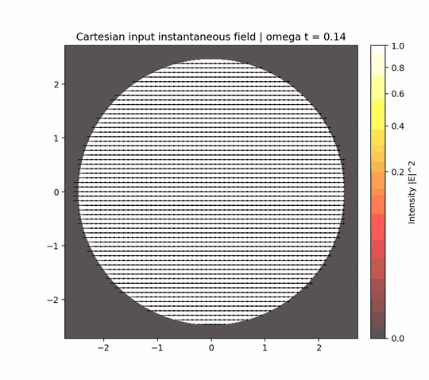

# vecdiff

Radial Hankel and Fresnel field-propagation utilities for vector diffraction
experiments. The project contains a small Python package, runnable examples, and
tests for working with sampled electromagnetic fields in Cartesian, polar, and
circular representations.

<p align="center">
  
</p>

## What Is Included

- Field containers for Cartesian, circular, and polar transverse components.
- Fourier-grid helpers for Cartesian propagation workflows.
- Hankel-transform utilities for radially symmetric propagation problems.
- Fresnel and diopter operators for vectorial field transmission.
- Polarization diagnostics and visualization helpers.
- Example scripts that generate reproducible figures and comparison outputs.

## Installation

Create and activate a Python environment, then install the package from the
repository root:

```bash
python -m pip install -e .
```

The package requires Python 3.10 or newer.

## Quick Check

Run the test suite from the repository root:

```bash
pytest
```

## Examples

Examples live in `examples/` and are intended to be run from the repository
root:

```bash
python examples/cartesian_simple.py
python examples/circular_simple.py
```

Generated artifacts are written under `examples/output/`. See
[`examples/README.md`](examples/README.md) for the current example list and
output layout.

## Package Layout

```text
vecdiff/          Python package
examples/         Runnable scripts and generated-output conventions
tests/            Unit tests
docs/assets/      README and documentation media
investigation/    Exploratory research scripts
```
