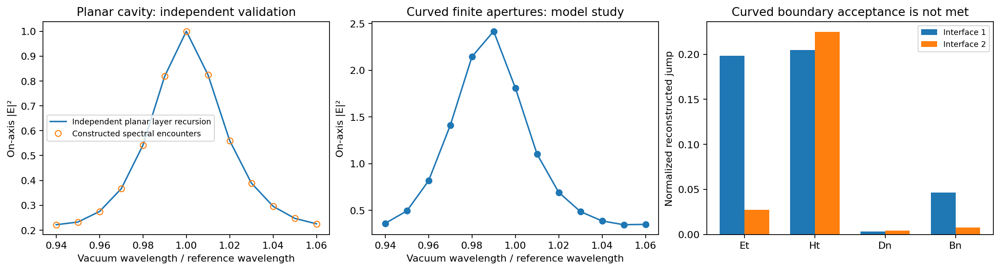
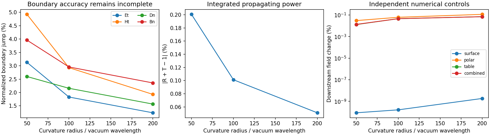
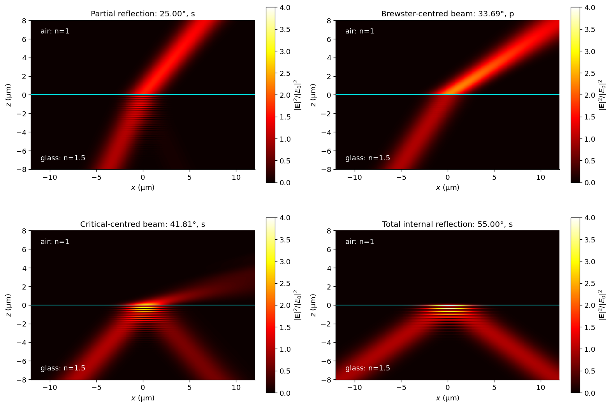
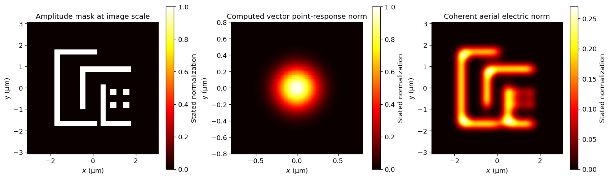
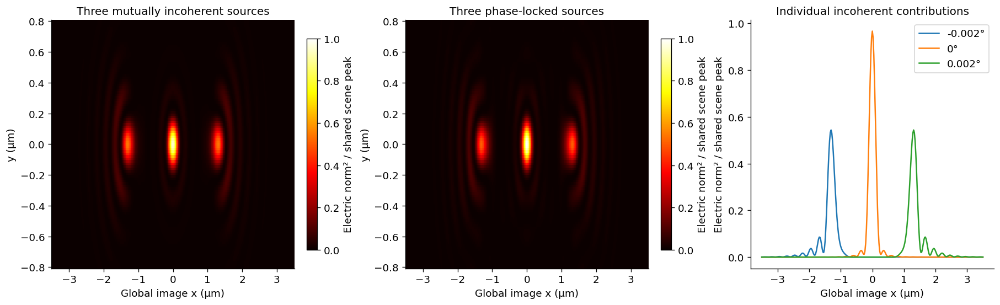
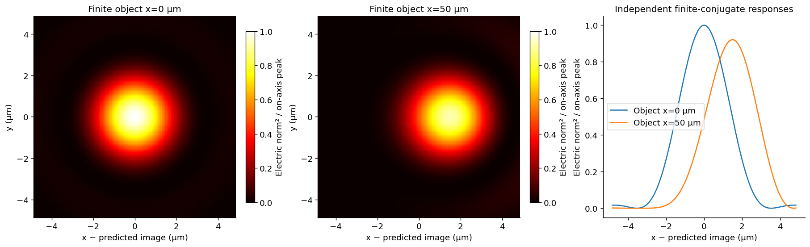

# vecdiff

Electric-field refraction and reflection as **spectral transformations**: each
incident wavevector gets its own Fresnel basis and coefficients at the surface,
then the resulting field is propagated using Maxwell representations.

Version 0.3 is a clean API break. There are **no compatibility aliases, wrappers,
or bundled old implementation**. Earlier code is available only in Git history.

<p align="center">
  
  
</p>

Preserved project animations of the instantaneous field `Re[E exp(-i omega t)]`:
linear polarization (left) and circular polarization (right). These original
stigmatic-model visualizations are retained from the pre-refactor repository;
they are not validation results for the general spectral interface method.

## Physical scope

| Operation | Status and limits |
| --- | --- |
| Homogeneous propagation | Maxwell angular spectrum, including explicit evanescent modes; finite-window sampling must converge |
| Infinite planar interface | Exact per-k Fresnel map for isotropic, lossless, nonmagnetic media |
| Parallel dielectric layers | All coherent reflection/refraction orders; stable decaying-factor scattering recursion, including frustrated TIR |
| General curved open interface | Per-k local tangent-plane **physical-optics approximation**; not a solved dielectric boundary |
| Ordered interface assemblies | Constructed coherent per-k encounters in separated z-graph geometries; propagating spectral lattice only. Planar limit validated; curved boundaries remain approximate |
| General resonant behavior through the spectral method | **Pending physical validation and extension** beyond ordered assemblies, including closed spheres and high-Q convergence |
| Macroscopic focal fields | Bounded local spectral expansion tested at a 10 mm conic radius and 193.368 nm; 0.0103% sampled E/H error against the same-current full radiation kernel. Dielectric-boundary accuracy remains open |
| Complete optical systems | Native prescription IO preserves mirrors, stops and folds; the complete 48-encounter DUV wave calculation remains pending |
| Richards–Wolf and Mie | External references, never dependencies of the core |

The main method is the per-k spectral interface transformation. Immediate application priorities
are lossless refractive DUV systems, telescopes, microscopes, and simple
reflections. See [future implementations](docs/future_implementations.md) for
the distinction between existing components, missing system validation, ideal
mirrors, and later metal/coating/EUV support.

“Exact” describes the governing representation in its stated geometry, not a
guarantee for finite numerical sampling or arbitrary resonant structures. In
particular, repeating an approximate curved-interface map does not by itself
make a closed-body solution exact.

This refactor is a development baseline, not a certification of general
resonant-body or macroscopic-instrument accuracy. The explicit pending work and
its acceptance criteria are tracked in the [roadmap](docs/future_implementations.md#pending-work).

## Installation

Python 3.10 or later:

```bash
python -m pip install -e '.[test,examples,notebooks,nufft,validation]'
python -m pytest -q
```

The core requires only NumPy and SciPy. Optional extras supply FINUFFT,
Matplotlib, notebook execution, and the independent Mie reference. Literature
references and examples are checkout-only and are not installed in the wheel.
For the measured Python 3.12 numerical environment, use
`-c requirements-validation.txt` with the installation command above.

## A spectral interface

```python
from vecdiff import Medium, Plane, DielectricInterface, plane_wave, interface_transform

air, glass = Medium(1), Medium(1.5)
incident = plane_wave(wavelength=0.532)
result = interface_transform(incident, DielectricInterface(Plane(), air, glass))
E, H = result.transmitted.evaluate([[0, 0, 1]])
```

`ElectricField` is the sampled electric state; `TransverseElectricField` is the
same state with unknown `Ez`. Unknown is not zero. `ElectricSpectrum` carries
explicit Maxwell wavevectors and complex, quadrature-weighted amplitudes.

## Coherent repeated reflections

```python
from vecdiff import LayerStack, propagate_layers

stack = LayerStack((air, glass, air), (2.0,))
solution = propagate_layers(incident, stack)
E_inside, H_inside = solution.evaluate([[0, 0, 1]], region=1)
```

The stack sums all round trips. `coherent_feedback` also accepts a general
linear round-trip map, with successive-encounter or GMRES iteration, a true
equation residual, and explicit failure on nonconvergence. It does not invent
surface-to-surface coupling or certify the accuracy of the supplied map.

`propagate_interfaces` constructs that coupling for an `InterfaceAssembly`:

```python
from vecdiff import Frame, CartesianGrid, InterfaceAssembly, propagate_interfaces

front = DielectricInterface(Plane(), air, glass)
back = DielectricInterface(Plane(Frame(origin=[0, 0, 2])), glass, air)
assembly = InterfaceAssembly((front, back))
field = propagate_interfaces(incident, assembly, CartesianGrid.from_spacing(1, 8))
E, H = field.evaluate([[0, 0, 1]], region=1)
```

Curved graphs require a quadrature per surface. The lattice's bandwidth and
period must converge independently; a converged feedback residual does not
certify the curved-boundary model. See the [assembly benchmark](examples/interface_assembly.py).



## Measured macroscopic behavior

The main spectral method has been tested at curvature radii 50, 100, and 200
vacuum wavelengths. Analytic azimuthal synthesis removes observation-phase
aliasing while retaining the resolved current harmonics. At R=200 wavelengths,
the propagating-power imbalance is 0.051%, but reconstructed boundary jumps
remain 1.24–2.36%. Complete macroscopic accuracy is therefore still pending.



Raw data and independent numerical refinements are in
[macroscopic.json](benchmarks/results/macroscopic.json). These are open-cap
diagnostics, not validated projection-system or complete-sphere results.

All lengths use the same chosen unit; wavelength is the **vacuum** wavelength.
Phasors use `exp(-i omega t)`. Returned `H` means `Z0 * H_SI`; `poynting` converts
this convention to SI flux when E is in V/m. `|E|²` is not generally power flux.

## Organization and scientific workflows

| Package | Physical or mathematical role |
| --- | --- |
| `fields/` | Electric states, spectra, polarization |
| `media/` | Constitutive media and ordered physical layers |
| `geometry/` | Frames and domains |
| `surfaces/` | Parametric physical boundaries |
| `interfaces/` | Dielectric configuration and `fresnel.py` |
| `propagation/` | Homogeneous, interface, and layer propagation; coherent feedback |
| `sampling/` | Spatial samples and surface quadrature |
| `fourier/` | Cartesian, Hankel, polar, and NUFFT algorithms |
| `observables/` | Boundary residuals and energy flux |
| `IO/` | Optical prescription import/export |

Only the API wrapper lives directly in `vecdiff/`. The dependency direction
from `references/` to shared abstractions is allowed; the reverse is tested
and forbidden.

Start with the [curated examples](examples/README.md) and
[nine executed notebooks](docs/notebooks/README.md). Each workflow has a stated
purpose, assumptions, assertions, labeled figures, and numerical provenance.
See [architecture](docs/architecture.md), [validation](docs/validation.md), and
[the migration/retirement record](docs/migration.md).

```bash
python -m examples.cavity_resonance
OMP_NUM_THREADS=1 OPENBLAS_NUM_THREADS=1 MKL_NUM_THREADS=1 \
  python -m benchmarks.validate_physics
python scripts/notebooks.py --check --execute
```

## Macroscopic fields and prescription IO


The [executed macroscopic notebook](docs/notebooks/03_stigmatic_refraction.ipynb)
shows transverse, meridional, longitudinal and polarization maps for a 24-mm-diameter
conic at 193.368 nm. A local plane-wave expansion of the per-k Fresnel radiation
evaluated 135,442 E/H points in about 0.68 s on one CPU thread. Its explicit
error bound is separate from quadrature error and from the still-unresolved
curved dielectric boundary error. See the [derivation, measurements and limits](docs/macroscopic_fields.md).

```python
from vecdiff.IO import read_prescription
system = read_prescription("examples/data/US7557996.csv")
```

Import preserves all 48 encounters, including the two mirrors and the stop.
It introduces no ray-tracer dependency and does not silently discard unsupported
physics when converting a prescription for propagation.

## Optical experiments

The [results report](docs/application_results.md) and
[nine executed application notebooks](docs/notebooks/README.md) show Gaussian
beam propagation, planar refraction and TIR, stigmatic dielectric focusing,
sphere resonance comparisons, circuit-pattern image formation from the main
method, a separate real-system DUV pupil reference, two-sided curved-boundary
verification, and direct field-dependent macroscopic refraction and reflection. Each includes fields,
physical units, measured results and numerical controls. Mie and the DUV pupil
reference remain explicitly separate from the main spectral interface method.





[Direct field-dependent imaging](docs/notebooks/08_field_dependent_optics.ipynb)
recomputes each distant-source response and combines fields on common physical
image coordinates, without a shifted PSF. Notebook 09 extends this to an explicit
high-frequency multi-interface path; general wave corrections remain pending.



## Fast transport through multiple interfaces

[Notebook 09](docs/notebooks/09_macroscopic_system_transport.ipynb) now carries a
smooth-phase electric field through both curved faces of a macroscopic element,
including finite-conjugate stigmatic recovery and displaced-source images. The
explicit high-frequency path preserves optical phase, vector Fresnel laws and
ray-tube spreading, then computes final diffraction. A measured one-phase image
calculation is about 888× faster than transporting 625 components, with 0.0218%
complex-field difference in that comparison. Read the [accuracy tests and domain](docs/high_frequency_transport.md); these are not exact full-Maxwell claims.


