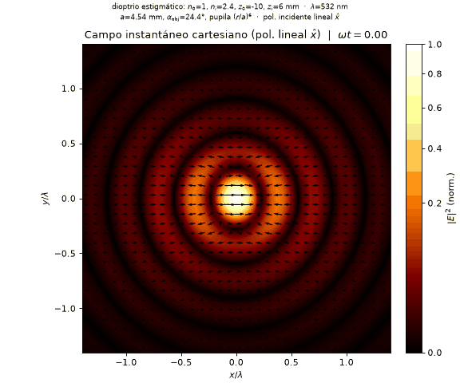
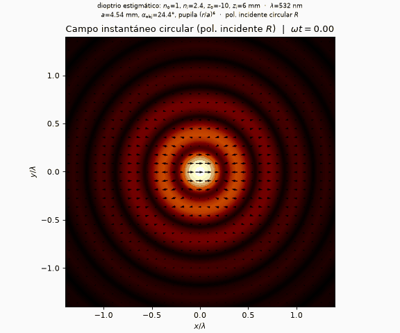

# vecdiff

Radial Hankel and Fresnel field-propagation utilities for vector diffraction
experiments. The project contains a small Python package, runnable examples, and
tests for working with sampled electromagnetic fields in Cartesian, polar, and
circular representations.

<p align="center">
  
  
</p>

<p align="center">
  <em>Instantaneous focal field <code>Re[E e<sup>-i&omega;t</sup>]</code> over the optical cycle
  (cross-maximizing edge pupil): linear-x incidence (left) makes the field
  <em>breathe</em>; circular incidence (right) makes it <em>rotate</em>.</em>
</p>

## What Is Included

- Field containers for Cartesian, circular, and polar transverse components.
- Fourier-grid helpers for Cartesian propagation workflows.
- Hankel-transform utilities for radially symmetric propagation problems.
- Fresnel and diopter operators for vectorial field transmission.
- Polarization diagnostics and visualization helpers.
- Time-harmonic field animation (the quiver above shows the instantaneous
  real field `Re[E e^{-i omega t}]` of a focused, cross-maximizing pupil over
  the optical cycle; regenerate it with `python examples/harmonic_field_animation.py`).
- Example scripts that generate reproducible figures and comparison outputs.

## Installation

Create and activate a Python environment, then install the package from the
repository root:

```bash
python -m pip install -e .
```

The package requires Python 3.10 or newer.

## Quick Check

Run the test suite from the repository root:

```bash
pytest
```

## Examples

Examples live in `examples/` and are intended to be run from the repository
root:

```bash
python examples/cartesian_simple.py            # single-diopter propagation basics
python examples/aperture_scalar_vs_vectorial.py  # scalar (t- = 0) vs vectorial focus
python examples/maximize_cross_polarization.py   # edge pupil maximizing the cross field
python examples/two_diopter_imaging.py           # orientation-dependent vectorial imaging
python examples/resolution_inversion.py          # scalar resolves, vectorial fuses
```

Generated artifacts are written under `examples/output/`. See
[`examples/README.md`](examples/README.md) for the current example list and
output layout.

## Package Layout

```text
vecdiff/          Python package
examples/         Runnable scripts and generated-output conventions
tests/            Unit tests
docs/assets/      README and documentation media
```
