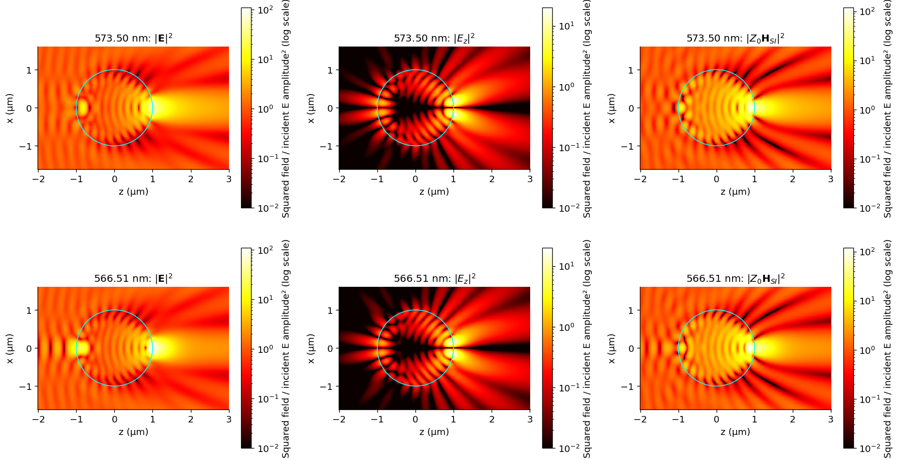
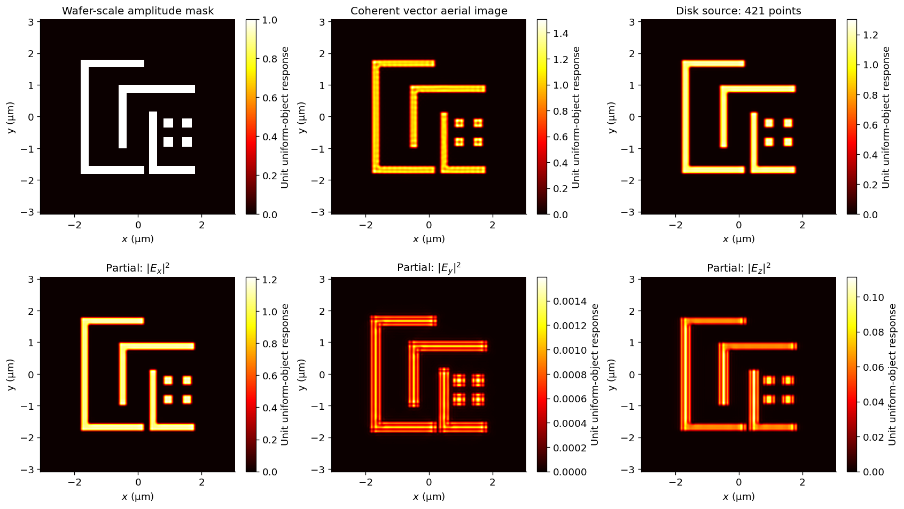
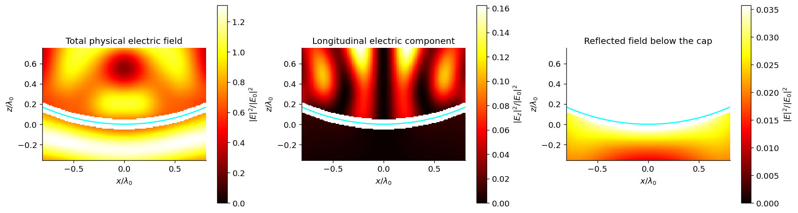
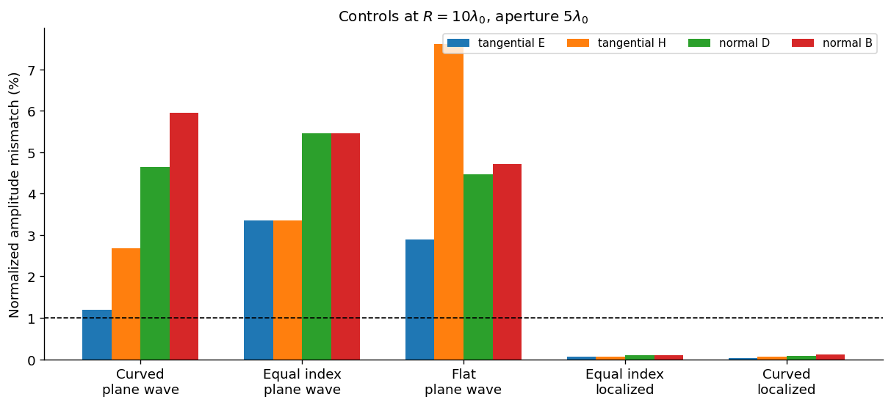
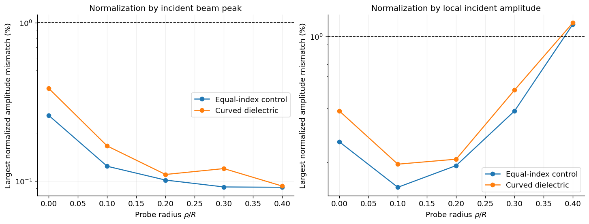
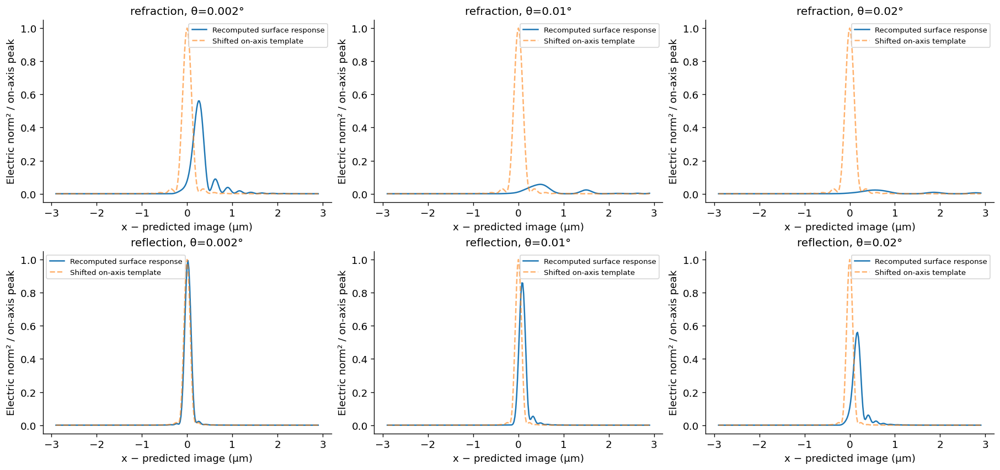
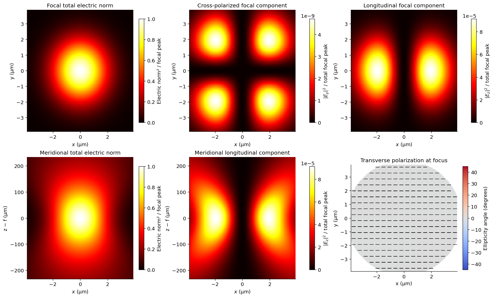
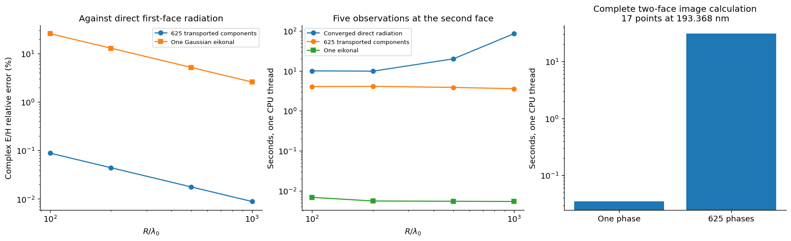

# Results from the optical application notebooks

The nine [executed notebooks](notebooks/README.md) contain the actual setup,
calculation, embedded figures and numerical checks. This page is a guide to their
results and the limits of those results. Electric-field norms are distinguished
from transported power throughout:

$$
\mathcal E(\mathbf r)=\|\mathbf E(\mathbf r)\|^2,
\qquad
\langle\mathbf S\rangle=\frac12\Re[\mathbf E\times\mathbf H_{SI}^{*}].
$$

## Main-method calculations

| Experiment | Measured result | What the check establishes |
| --- | --- | --- |
| 532 nm Gaussian beam, 1.2 µm waist | 0.5055% longitudinal electric-norm fraction at the waist; sequential forward propagation agrees with one combined step to approximately $2\times10^{-14}$ | A specified transverse field is completed and can be propagated again; window and pixel controls are included |
| Glass–air plane, $n_1=1.5$, $n_2=1$ | Brewster angle 33.690068°, critical angle 41.810315°; reconstructed plane-wave boundary jumps below $5\times10^{-15}$ | Exact planar Fresnel transformation, Snell refraction and energy balance |
| TIR at 55°, 532 nm | Amplitude penetration depth 118.59 nm; intensity penetration depth 59.29 nm | Nonzero evanescent transmission with the expected exponential decay |
| Stigmatic 24 mm diameter conic at 193.368 nm | NA 0.427353; local versus full-radiation complex E/H error approximately $1.11\times10^{-4}$ at held-out points | Accuracy of the local radiation expansion for the same Fresnel currents; **not** a global dielectric-boundary error |
| Circuit imaging with a 4 mm waist Gaussian illuminating that conic | Doubling the point-response window changes the complex image by approximately 0.002% | Controlled finite-window convolution in an explicitly local isoplanatic experiment |

The finite beam near the critical angle contains both propagating and
evanescent transmitted modes. A single ray angle cannot describe that complete
beam. The notebook evaluates the spectra on both sides and checks all four
Maxwell boundary conditions after their coherent superposition.

The lithographic image is calculated from the **complex vector point response**,
not by blurring an intensity image. Each mutually incoherent source is propagated
separately before its component intensities are summed:

$$
\mathbf E_s=\mathbf h*(m e^{i\mathbf q_s\cdot\mathbf r}),
\qquad I=\sum_s w_s\|\mathbf E_s\|^2,\quad\sum_s w_s=1.
$$

The Gaussian illumination is a physical input choice, synthesized from Maxwell
plane waves. It differs from the uniformly illuminated spot study. The notebook
reports source-quadrature sensitivity as well: the coarse 49-point source differs
from the 213-point source by about 4.7% in aerial-image norm, so the coarse source
is insufficient for percent-level intensity work. Image-window convergence does
not establish source convergence or validate the local isoplanatic assumption.

## Independent reference calculations

The reference implementations remain outside `vecdiff/`. They can use its shared
field abstractions; the main implementation never imports them.

**Sphere resonance.** A fixed 2 µm diameter sphere with index 1.5 has a selected
scattering peak near 566.514 nm and a nearby valley at 573.500 nm. The Mie volume
mean of $\|E\|^2/|E_0|^2$ rises from about 1.22 to 2.15 between those two settings.
Extra multipoles change the sampled complex E/H by approximately $10^{-10}$,
and a shrinking-offset boundary check is shown in the notebook.

The current single-encounter spectral sphere diagnostic has approximately **62%**
complex-electric-field error in both sampled interior and exterior regions at
the selected resonance. The notebook puts its field beside Mie and includes an
error map. **Closed-sphere resonant propagation remains pending.** These Mie
plots cannot be used as evidence that the main method already reproduces it.

**DUV patent-system pupil reference.** At 193.368 nm, NA 1.2, image index
1.59667693 and the stored 62 mm object field, the defined vector-pupil reference
produces x/y focal FWHM values of approximately 95.53/80.30 nm. The same transfer
is used for the vector PSF, meridional field and circuit image. A TE/TM
line-grating study uses analytic grating coefficients and reports source
refinement; the 421-to-1649-source comparison changes selected TM contrasts by
less than 0.005 in absolute contrast. Pixel and pupil-frequency spacing are
checked separately.

This is a ray-traced wavefront plus an independent sine-condition pupil model,
with [data provenance](../examples/data/README.md). It assumes uniform entrance
illumination and omits coating losses and pupil transmission. **Main-method
propagation through the complete 48-encounter folded objective remains pending.**
Neither this reference nor the conic experiment certifies a production
lithography instrument, electromagnetic mask model, or resist process window.

## Curved boundaries: reconstructed fields and aperture controls

[Notebook 07](notebooks/07_curved_boundary_verification.ipynb) evaluates the main
reflected and transmitted fields with the full dyadic Green kernel on opposite
sides of a spherical cap. Target-centred quadrature resolves the near field.
Two source resolutions and four shrinking offsets separate quadrature error
from the extrapolated complex-field boundary mismatch. No reference boundary
solver or fitted phase/amplitude is involved.

The following values are the largest of four normalized **amplitude** residuals
at $\rho/R=0.2$, $\phi=45^\circ$, with aperture radius $a=R/2$. They are pointwise
acceptance diagnostics, not a uniform error bound or image accuracy estimate.

| Illumination and interface | $R/\lambda_0$ | Maximum boundary mismatch |
| --- | ---: | ---: |
| Plane wave, $1\to1.5$ | 2 | 17.315% |
| Plane wave, $1\to1.5$ | 10 | 5.951% |
| Plane wave, $1\to1.5$ | 30 | 3.107% |
| Plane wave, $1.5\to1$ | 30 | 2.001% |
| Plane wave, equal-index curved control | 10 | 5.458% |
| Plane wave, truncated flat control | 10 (aperture scale) | 7.618% |
| Localized 121-mode beam, equal-index curved control | 10 | 0.102% |
| Localized 121-mode beam, $1\to1.5$ | 10 | 0.110% |

All eleven recorded cases pass the specified numerical checks: source-quadrature
changes below $5\times10^{-12}$ and offset-extrapolation changes below
$6.2\times10^{-6}$. The hard-aperture cases fail the 1% boundary criterion;
the two localized cases pass at the tested location. Equal-index and flat controls
show why hard-aperture mismatch cannot be attributed entirely to curvature.
The localized result supports this particular regime, not exact arbitrary curved
scattering. Residuals are scaled to the defined incident amplitude, not to the
smaller local transmitted amplitude.

Reproduce the full data with `python -m benchmarks.curved_boundary_limits`.
The notebook also recomputes the localized dielectric case from the current code.

The localized probe scan also checks $\rho/R=0,0.1,0.2,0.3,0.4$ along
$\phi=45^\circ$. Normalizing to the **local** incident amplitude gives dielectric
residuals of 0.385%, 0.196%, 0.208%, 0.504%, and **1.188%**. The equal-index
control reaches 1.167% at the last probe. Thus the localized example does not
establish uniform 1% boundary accuracy even along this meridian. All ten scan
cases pass numerical convergence checks.

## Macroscopic responses without shift invariance

[Notebook 08](notebooks/08_field_dependent_optics.ipynb) computes each incident
object direction independently on a 24-mm-diameter refracting conic and an
8-mm-diameter dielectric reflecting paraboloid, at 193.368 nm. A new local
spectrum is constructed for each observation patch at its actual global position.
The predicted image displacement selects an observation window; it does not
translate a precomputed point response.

For angles $0,0.002,0.01,0.02$ degrees, held-out complex $E/\mathcal H$ kernel
errors are $2.9\times10^{-5}$–$5.6\times10^{-5}$ for refraction and
$1.9\times10^{-4}$–$2.4\times10^{-4}$ for reflection. Absolute kernel bounds pass.
Doubling the source quadrature from $128\times256$ to $256\times512$ changes
these held-out fields by less than $3.2\times10^{-11}$. Construction plus a
241-point line takes roughly 1–1.5 seconds in the recorded single-thread run;
these timings are configuration-specific.

At $0.002^\circ$, the refracting conic's line peak is 56.2% of its on-axis value;
at $0.02^\circ$ it is 2.24%. The dielectric paraboloid retains 56.2% at
$0.02^\circ$. These are sampled line peaks relative to the same on-axis
illumination, not integrated throughput or a Strehl ratio. The shapes and image
positions also change. An on-axis translated template cannot reproduce them.

The three-source scene combines separately propagated vector fields coherently
or incoherently on a shared physical image grid. It uses no PSF convolution.
Meridional fields and polarization accompany it in the notebook.

**Remaining gate:** these results establish numerical evaluation of macroscopic
single-surface physical-optics responses. They do not establish full dielectric
boundary accuracy, general wave transport between extended surfaces, folded
multi-element instruments, or full-system lithographic imaging. The explicit
high-frequency multi-interface implementation added in notebook 09 is described below. The existing
isoplanatic mask example and separate DUV pupil reference retain their explicit
scope; neither substitutes for that unfinished implementation.

## Implemented macroscopic transport through both curved faces

[Notebook 09](notebooks/09_macroscopic_system_transport.ipynb) now propagates the
field through an entrance asphere and exit sphere before computing diffraction.
It also recovers a finite-conjugate Cartesian-oval/spherical element and recomputes
its response to a displaced object. This closes the missing implementation of
multi-interface transport **within the explicitly chosen high-frequency domain**.

The optimization transports one ray per surface sample for each known smooth
phase. It retains vector Fresnel transformations, optical phase and geometric
spreading. A single `EikonalElectricField` has one component; an `ElectricSpectrum`
retains all components separately. The final radiation still computes vector
image diffraction. Automatic Fourier backend selection also avoids creating
NUFFT plans for very small observation patches.

At 193.368 nm, the final image-field comparison takes **0.0347 s with one phase**
and **30.793 s with 625 transported components**, for 17 observations and 2,048
surface samples per component. Their complex E/H fields differ by **0.0218%**.
Both use the same high-frequency inter-face approximation; the approximately
888× speedup is a phase-compression result, not a full-Maxwell performance claim.

The separate direct-current reference test gives component-wise transport errors
of **0.0883%, 0.0442%, 0.0177%, and 0.00886%** at $R/\lambda_0=100,200,500,1000$.
The one-phase Gaussian reduction is substantially less accurate at those small
sizes, which the notebook shows rather than conceals.

See [the method, measurements and domain](high_frequency_transport.md). Intermediate
edge diffraction, caustic crossings, resonant feedback and complete folded DUV
systems remain outside the present implementation.
