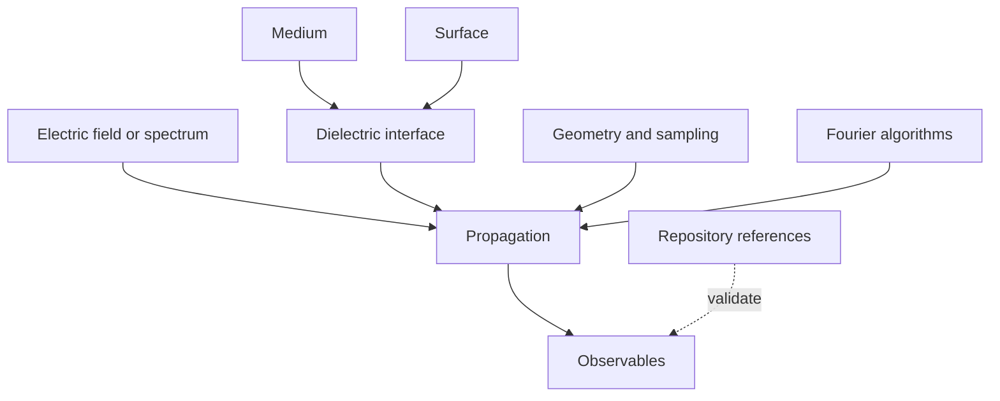

# Physical architecture

The dependency direction follows the physical ontology. A field is a state; a
surface and a medium describe its environment; an interface joins these
configuration objects; propagation evaluates a law; sampling and Fourier
routines realize that evaluation numerically.

The dashed dependency is only in tests and benchmarks. Nothing under
`vecdiff/` imports `references/`.

## State

`ElectricField` is the general sampled electric field. It always carries a
physical domain, independent sampling, vacuum wavelength, and medium. `Ez=None`
means that the longitudinal component is unknown. A supplied zero is a real
zero and is checked for Maxwell transversality.

`TransverseElectricField` is a convenience subclass whose constructor accepts
only `Ex` and `Ey`. It does not mean TE polarization. Calling `complete()`
returns an `ElectricField`; it does not mutate the transverse object.

`ElectricSpectrum` contains discrete Maxwell plane waves. Each wavevector must
satisfy the medium dispersion relation and each electric amplitude must satisfy
`k dot E = 0`. Its amplitudes include spectral quadrature weights, so evaluation
has the unambiguous form

\[
  \mathbf E(\mathbf r)=\sum_j \mathbf a_j e^{i\mathbf k_j\cdot\mathbf r}.
\]

Magnetic amplitudes follow from `Z0 H = (k/k0) cross E`.

## Interface transformation

`interfaces/fresnel.py` owns the local boundary law. For every incident
wavevector and oriented normal it constructs the s/p frames, reflected and
transmitted wavevectors, and vector amplitudes. The normal-incidence basis is
chosen by a transverse-axis construction, avoiding the former non-transverse
global-x fallback.

`propagation/interface_transform.py` applies that law. The plane path remains
diagonal in tangential spatial frequency and is exact. The curved path samples
the full incident spectrum at each surface point but retains each incident
wavevector through the Fresnel operation. No direction is inferred from the
phase gradient of a total interfering field.

The curved transform returns boundary data and two `SurfaceRadiation` objects.
The latter are equivalent-current Maxwell representations. Their Green and
angular-spectrum evaluations solve propagation from prescribed currents. They
do not solve for globally self-consistent currents.

## Numerical realization

`sampling/` owns coordinates and quadrature weights. A physical interface owns
no FFT size, tolerance, apodization, or mode limit. `fourier/nufft.py` contains
only a nonuniform Fourier sum. `fourier/polar.py` implements the separate
azimuthal harmonic transform used for axisymmetric surfaces. Harmonic-tail
truncation is checked explicitly.

No propagation routine applies a hidden horizon taper. Evanescent terms and
finite-aperture edges are explicit modeling and quadrature choices.

## References

The repository-level `references/` package contains Lorenz-Mie,
Richards-Wolf, Stratton-Chu, Kirchhoff, and the preserved 0.2 implementation.
They may consume shared field representations where useful, but the core does
not call them and benchmarks state when a reference shares prescribed boundary
data with the method being checked.
