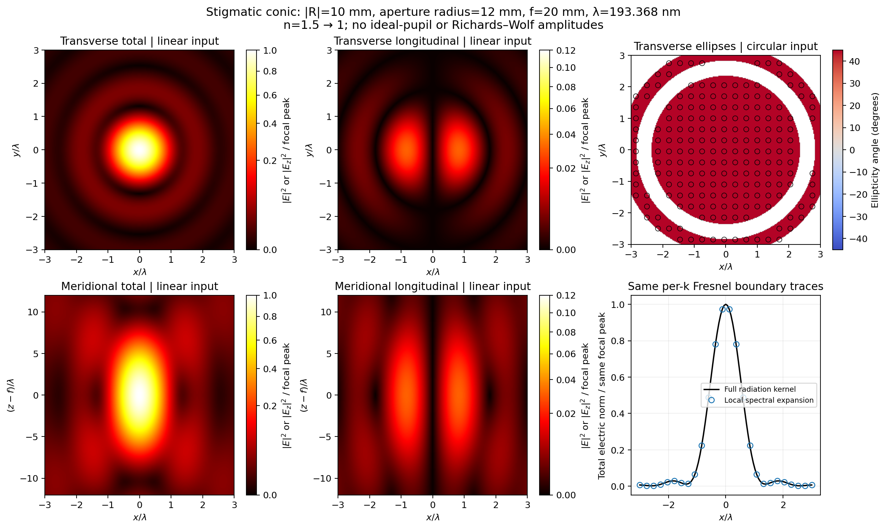

# Macroscopic fields: implemented advance and unresolved physics

This work adds a bounded local plane-wave representation of the existing
per-k Fresnel surface radiation, and native prescription import/export in
`vecdiff/IO/`. It does **not** certify a complete projection objective.



## Measured experiment

The example `python -m examples.macroscopic_focus` uses millimetres:

- Vacuum wavelength 193.368 nm; indices 1.5 → 1 (specified constants, not a material catalogue).
- Conic curvature radius -10 mm, conic constant -2.25, aperture radius 12 mm.
- Plane-wave illumination; geometrical stigmatic image at z=20 mm.
- 2,048 surface samples; 241×241 transverse and 301×241 meridional field points.
- The observation ball has radius 13 wavelengths around the image point.

One-thread local measurements gave 0.006 s construction and 0.63 s for both
E/H maps (130,622 points). Against the existing full dyadic radiation kernel at
50 held-out observations, the relative concatenated complex E/H error was
1.032×10^-4. Independent radial and azimuthal refinements changed the reference
field by about 1.7×10^-11 and 9.3×10^-12, respectively. NUFFT versus direct
spectral summation differed by 8.9×10^-11. No phase alignment, fitted amplitude,
or separate intensity normalization is used in these comparisons.

The rigorous *discrete-current kernel* bound on electric error throughout the
ball is 0.00620 times the peak focal electric amplitude. It is conservative and
is not the sampled relative error above. Hardware-dependent timings are not
universal speed guarantees. The squared component fractions are electric norms,
not integrated Poynting flux or detector response. Plot brightness uses a square-
root colour normalization with labelled absolute ratios to one focal peak;
longitudinal panels use a separate 0–0.12 range to expose their structure.

`python -m benchmarks.macroscopic_focus` independently repeats scale controls:

| Curvature radius / wavelength | Radius, mm | E/H error against full current radiation |
|---:|---:|---:|
| 200 | 0.0386736 | 2.662% |
| 2,000 | 0.386736 | 0.2668% |
| 20,000 | 3.86736 | 0.02668% |
| 51,714.865 | 10 | 0.01032% |

These experiments hold the observation window fixed in wavelengths while
scaling the same conic. They establish a useful macroscopic **focal-field**
capability, not a general error law or a near-interface approximation.

## Why the expansion is fast

For a sampled source point $\mathbf Q_j$ and observation centre $\mathbf c$,
write $d_j=|\mathbf c-\mathbf Q_j|$,
$\mathbf u_j=(\mathbf c-\mathbf Q_j)/d_j$, and
$\boldsymbol\delta=\mathbf r-\mathbf c$. The distance is expanded as

$$
|\mathbf c+\boldsymbol\delta-\mathbf Q_j|
=d_j+\mathbf u_j\cdot\boldsymbol\delta+\mathcal R_j,
\qquad |\mathcal R_j|\leq\frac{b^2}{2(d_j-b)},\quad |\boldsymbol\delta|\leq b<d_j.
$$

With surface quadrature weights included in $\mathbf J_j$ and $\mathbf M_j$,
the leading radiation gives electric plane-wave coefficients

$$
\widetilde{\mathbf E}_j=\frac{i e^{ikd_j}}{4\pi d_j}
\left[k_0(\mathbf I-\mathbf u_j\mathbf u_j^T)\mathbf J_j
-k\mathbf u_j\times\mathbf M_j\right],\qquad
\mathbf k_j=k\mathbf u_j.
$$

They come from the **actual per-mode Fresnel boundary traces**, not from an
ideal aplanatic pupil or a Richards–Wolf amplitude prescription. The result is

$$
\mathbf E(\mathbf r)\approx\sum_j\widetilde{\mathbf E}_j
 e^{i\mathbf k_j\cdot(\mathbf r-\mathbf c)},\qquad
\widehat{\mathbf H}_j=\mathbf k_j\times\widetilde{\mathbf E}_j/k_0.
$$

Each retained wave is exactly transverse and obeys the homogeneous dispersion
relation. Source-to-centre phases cancel the incident phases for a stigmatic
surface. The quadrature therefore resolves the **combined residual phase**.
Its nodes need not resolve each optical oscillation separately. This advantage
must be checked by independent source refinements; arbitrary aberrated surfaces
or broad incident spectra can require many more samples.

The NUFFT sees offsets from the centre, not a centimetre-scale observation
coordinate multiplied by a full optical bandwidth. Its cost depends on source
count, observation count, tolerance and the local space–bandwidth product.
Increasing the lens size alone does not increase these in this focal experiment.

## What the error bounds actually cover

Let $r_-=d-b$, $g_0=(4\pi d)^{-1}$,
$D_u=2b/(d-b)$ and

$$
D_g=\frac{1}{4\pi}\left[\frac{b}{d(d-b)}
+\frac{\min(2,kb^2/[2(d-b)])}{d}\right].
$$

The code adds bounds for geometric amplitude changes, direction/projector
changes, phase remainder and the omitted reactive terms. For example,

$$
B_E=\sum_j\left\{D_g(k_0|\mathbf J_j|+k|\mathbf M_j|)
+g_0D_u(2k_0|\mathbf J_j|+k|\mathbf M_j|)
+k_0D_N|\mathbf J_j|+D_C|\mathbf M_j|\right\},
$$

where $D_N=2[(kr_-)^{-1}+(kr_-)^{-2}]/(4\pi r_-)$ and
$D_C=(4\pi r_-^2)^{-1}$. The dual expression bounds normalized magnetic error.
These exact-arithmetic triangle-inequality bounds apply to every point in the ball, relative to
radiation by the **same discrete currents**. Floating-point and NUFFT errors are
checked separately and are not included in the analytic bound. Evaluation outside the ball fails
explicitly. They exclude:

1. Surface quadrature error.
2. Error of local tangent-plane Fresnel data as dielectric boundary traces.
3. Missing encounters, finite-aperture modelling errors, or inaccurate materials.

A field that solves homogeneous Maxwell equations does not necessarily satisfy
Maxwell boundary conditions on the dielectric. The earlier curved-boundary
failures remain unresolved. Comparing two radiation kernels cannot close that
physical validation gate.

## Prescription IO

```python
from vecdiff.IO import read_prescription, write_prescription
system = read_prescription("examples/data/US7557996.csv")
print(len(system.encounters), system.wavelength, system.image_z)
write_prescription(system, "roundtrip.csv")
```

The native CSV dialect follows `geometrical-raytracer` and is implemented only
in `IO/`. Physical encounter records live in `interfaces/`; asphere geometry
lives in `surfaces/`. No runtime ray-tracer dependency is introduced.

Import preserves refractive indices at the selected wavelength, signed radii,
conic and r^4…r^14 asphere coefficients, clear apertures, mirrors, stops, repeated
encounters, signed spacings and vertices. Multiple wavelength columns require
explicit selection. Missing index data, unknown surface kinds and inconsistent
vertices fail; no index is inferred from a glass name. Round trips preserve the
geometry and media to floating-point precision.

The imported DUV prescription contains 48 encounters, two mirrors (7 and 10),
an aperture stop, and an image coordinate of 1423.0777 mm. A negative thickness
to a virtual stop does not reverse the beam; reflection changes its direction.
The native table describes a coaxial folded path, not arbitrary coordinate breaks.

`system.dielectric_assembly()` accepts all-dielectric records and explicitly
rejects mirrors/stops. It cannot silently turn this DUV objective into a
supported all-dielectric assembly. Propagator geometry/domain restrictions still
apply even when conversion succeeds. Finite clear apertures remain explicit
sampling bounds and are not applied automatically by this conversion.

## Research route to complete macroscopic systems

An explicit [high-frequency multi-interface implementation](high_frequency_transport.md)
now covers smooth-phase dielectric paths and recovers the finite-conjugate case.
The requirements below concern general wave corrections and full instruments.

The next numerical problem is transport **between extended interfaces**, where
one small observation ball is insufficient. The implementation should cover
these domains with controlled local spectra, retain coherent amplitudes and
Fresnel mode dependence, and adapt quadrature to the residual phase. A usable
implementation needs a measured truncation bound and convergence under patch
subdivision. It must include folded encounters and explicit mirror constitutive
models, not assume that parsing a mirror supplies its complex reflection phase.

In parallel, globally consistent spectral boundary traces must replace or
correct the local traces wherever their residual is unacceptable. That is the
accuracy bottleneck; increasing the number of reflections cannot by itself
repair an incorrect interface transform. Closed-sphere Mie comparisons and
complete DUV prescriptions remain acceptance gates, not substituted reference
outputs. Neither this change nor the imported data closes those gates.

## Sources and methodological distinctions

- T. Kozacki and K. Falaggis, *Angular spectrum method with compact space–bandwidth:
  generalization and full-field accuracy*, Applied Optics 55, 5014–5024 (2016),
  [doi:10.1364/AO.55.005014](https://doi.org/10.1364/AO.55.005014).
  Motivation for reducing represented phase/bandwidth; their paraxial algorithm
  is not copied into the present nonparaxial local expansion.
- [FINUFFT mathematical definitions](https://finufft.readthedocs.io/en/latest/math.html)
  and [space–bandwidth cautions](https://finufft.readthedocs.io/en/latest/trouble.html).
  NUFFT alone does not remove a massive physical space–bandwidth product.
- J. Kim, Y. Wang and X. Zhang, *Calculation of vectorial diffraction in optical
  systems*, JOSA A 35, 526–535 (2018),
  [doi:10.1364/JOSAA.35.000526](https://doi.org/10.1364/JOSAA.35.000526).
  System-level vector ray/diffraction literature, considered as context; the
  implementation above uses the existing Fresnel current representation.
- [US7557996B2](https://patents.google.com/patent/US7557996B2/en), Fig. 3 / Table 3;
  [source CSV at geometrical-raytracer revision 87d2e66](https://github.com/blancusjh/geometrical-raytracer/blob/87d2e66a10c18456b590a170c0d1b460fae9d4ac/data/optical_systems/lithography/US7557996_Fig3_Table3_prescription.csv).
- [wavec lithography notebook](https://github.com/blancusjh/wavec/blob/main/notebooks/lithography.ipynb):
  inspiration for observables and presentation. Its ray-traced-pupil/Richards–Wolf
  DUV fields are not used as output of the main method here.

## Field-dependent observation patches

`SurfaceRadiation.evaluate_local(points, radius=..., backend='nufft')` partitions
actual global observation coordinates and constructs a fresh local spectrum from
the currents for each occupied patch. It returns electric and magnetic arrays,
uniform absolute kernel error bounds, and a patch count. It preserves coordinate
shape and coherent phase. The bounds exclude source quadrature and errors in
local Fresnel traces.

```python
from examples.field_dependent_optics import response, WAVELENGTH
import numpy as np
radiation, center = response('refraction', 0.002)
x = np.linspace(-10, 10, 201) * WAVELENGTH
points = center + np.c_[x, 0*x, 0*x]
result = radiation.evaluate_local(points, radius=4*WAVELENGTH)
```

The example helper constructs a fresh incident spectrum and interface transform
for every direction. `evaluate_local` itself evaluates one fixed set of currents;
it does not infer a changed object or reuse a translated PSF. The demonstration
in [notebook 08](notebooks/08_field_dependent_optics.ipynb) includes refracted and
reflected off-axis fields and a directly propagated three-source image.

The earlier implementation's stigmatic reference-sphere mapping and known
single-source geometry remain useful recovery targets. They must not be equated
with a generic invariant-shift pupil model or silently inserted as a local-ray
replacement for the per-wavevector transform. General macroscopic composition
still requires phase-aware **extended destination-surface** sampling, preservation
of incident modal directions at each encounter, and convergence checks on the
combined phase at each destination. Tiling observation coordinates alone does not
solve that source-sampling problem. Near-focus performance must not be extrapolated
to arbitrary surface-to-surface distances or field angles.
