# Estudio: campo en el plano focal al incrementar la apertura — escalar (t₋ = 0) vs vectorial

Fecha: 2026-07-02 · Modelo: Fresnel **exacto** sobre el óvalo cartesiano (`FresnelOvoid`),
propagación de Hankel del paquete (`H0`/`H2`) para el spot y cadena FFT de dos dioptras
para imágenes. Longitud de onda λ = 532 nm salvo indicación.

## Marco

Para una pupila con polarización lineal x̂ y perfil radial P(r), el campo transversal
en el plano focal es

```
E_x(q, φ) = A(q) − cos(2φ)·B(q)          (copolar)
E_y(q, φ) =       − sin(2φ)·B(q)          (cruzada)

A = 2π H0[t₊ P]      t₊ = (tp + ts)/2
B = 2π H2[t₋ P]      t₋ = (tp − ts)/2
```

El **caso escalar** del estudio es exactamente `t₋ = 0` (misma apodización t₊, sin
mezcla de polarización): toda diferencia escalar/vectorial es atribuible al kernel B.
Contabilidad de energía: `E_total = 2π∫(|A|²+|B|²) q dq`, `E_cruzada = π∫|B|² q dq`,
y definimos `f_cross = E_cruzada / E_total` (máximo teórico absoluto: 1/2).

## Hallazgo estructural previo: la apertura del óvalo es finita

El óvalo cartesiano es una **superficie cerrada**. Para la geometría base
(n₀=1, nᵢ=1.5, z₀=−10, zᵢ=6) la incidencia se hace **rasante (θᵢ→90°) en ρ ≈ 3.76 mm**;
más allá, la parametrización ρ recorre la cara trasera del óvalo, que no es una pupila
física de primera superficie. Todos los barridos se restringen a esa rama física
(`common.grazing_radius()`), y los ángulos se calculan con el radio cilíndrico real
r_cyl(ρ), no con ρ: el ángulo de aceptación objeto satura en **α_obj ≈ 10.5°** aun
cuando la convergencia imagen alcanza θ_img ≈ 38°.

Nota de modelo: los coeficientes **paraxiales** (`FresnelOvoidParax`) sobreestiman
brutalmente la mezcla a radios grandes (|t₋/t₊| ≈ 0.48/0.90 ≈ 0.54 en r=2.6, donde el
exacto da ≈ 0.10). Las conclusiones cuantitativas requieren el modelo exacto.

## Estudio 1 — Barrido de apertura (`study_1_aperture_sweep.py`)

Pupila uniforme, geometría base, a ∈ [0.4, 3.72] mm (32 puntos).

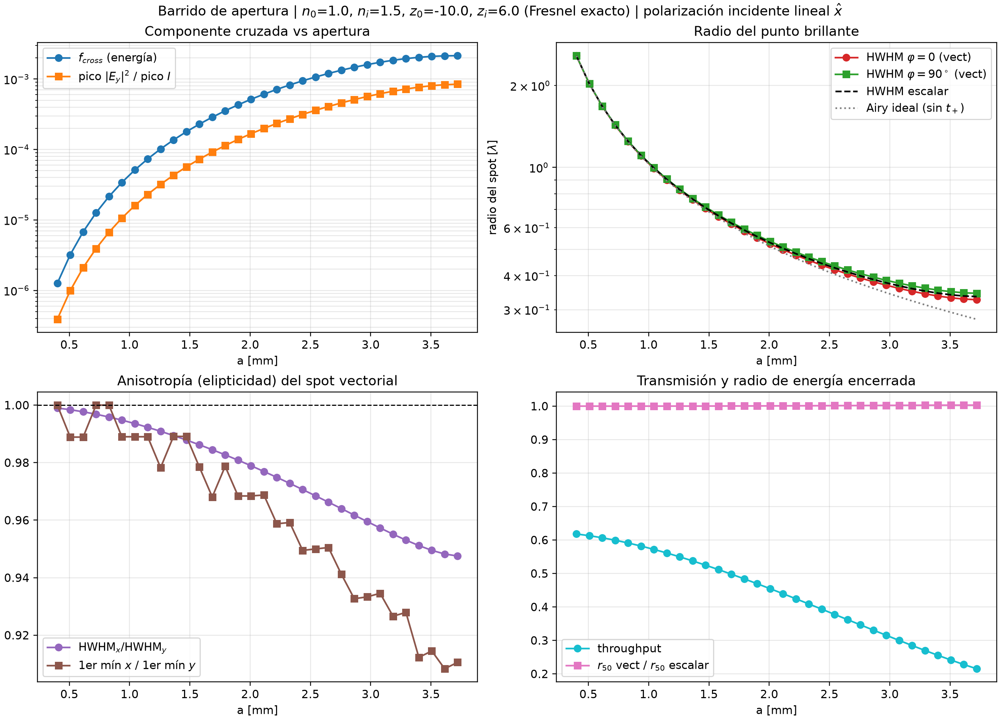
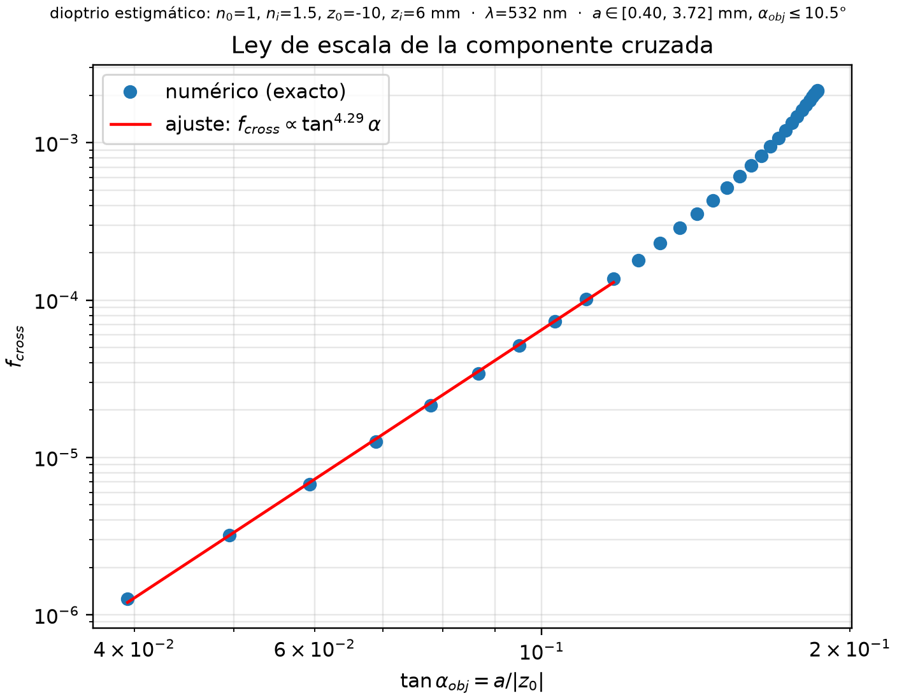

- **Crecimiento y saturación de la componente cruzada.** A apertura pequeña
  `f_cross ∝ tan^4.3(α_obj)` — compatible con la ley paraxial a⁴ que se obtiene de
  t₋ ∝ r² (el exponente >4 recoge la corrección exacta). Al llegar al límite de
  aceptación del óvalo, satura en **f_cross ≈ 2.15×10⁻³** (nᵢ = 1.5). El cociente de
  picos `max|E_y|² / max I` satura en ≈ 8.4×10⁻⁴.
- **Radio del punto brillante.** El caso escalar es radialmente simétrico. El
  vectorial es **anisótropo**: HWHM más angosto a lo largo de la polarización
  (φ=0) y más ancho perpendicular (φ=90°), con el escalar en medio. A máxima
  apertura: HWHM_x = 0.513, HWHM_esc = 0.527, HWHM_y = 0.541 (unidades q), es decir
  ±2.6% alrededor del escalar. En unidades focales: HWHM escalar ≈ 0.34 λ.
- **Forma.** La deformación es cuadrupolar (cos 2φ): el spot total queda **elongado
  perpendicular a la polarización** en este régimen transversal (elipticidad
  HWHM_x/HWHM_y hasta **0.947**; en el primer mínimo hasta 0.91). ΔI = I_vec − I_esc
  tiene el patrón de cuatro lóbulos alternantes con amplitud ~1% del pico a máxima
  apertura. El radio de energía encerrada r₅₀ apenas cambia (cociente ≈ 1.000–1.001):
  la mezcla **redistribuye** energía angularmente más de lo que ensancha el spot.
- **Apodización.** t₊ decae hacia el borde (throughput 0.62 → 0.21), de modo que el
  spot real queda por encima del Airy ideal 1.61/a; el beneficio marginal de abrir la
  apertura disminuye antes del límite geométrico.

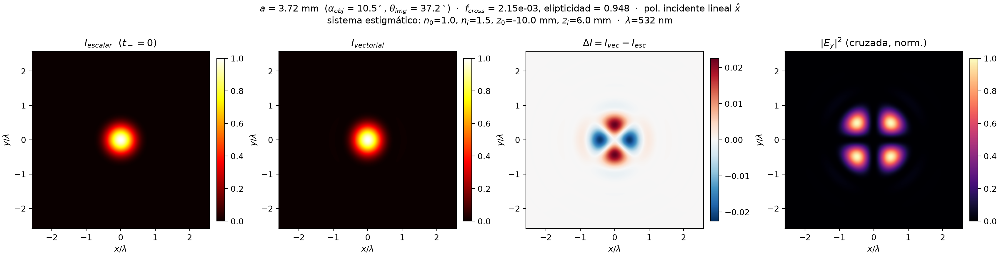
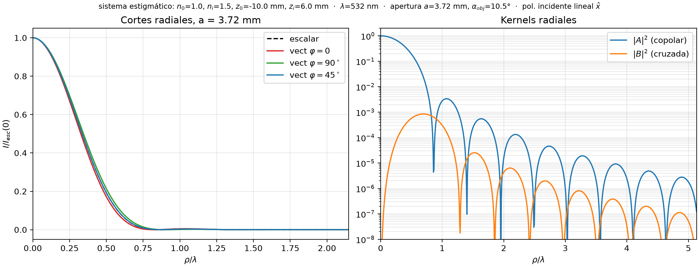

El canal cruzado |E_y|² es el **trébol sin²(2φ)** con cuatro lóbulos en las diagonales
(radio del lóbulo ~0.3 λ) y cero exacto en el origen (H2 → 0 en q=0).

## Estudio 2 — Maximización de la componente cruzada (`study_2_maximize_cross.py`)

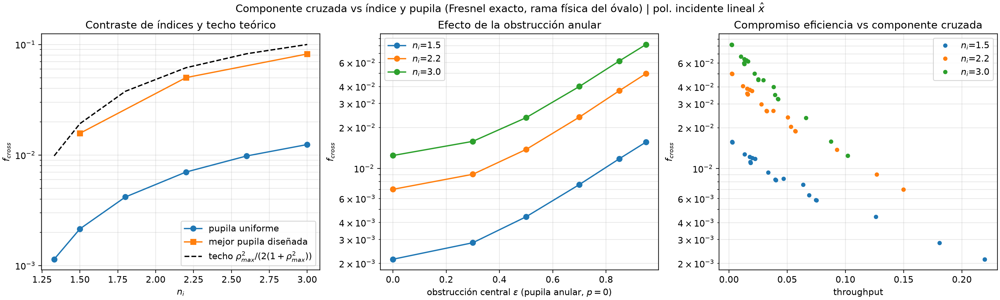

- **Techo teórico por contraste de índices.** En incidencia rasante los coeficientes
  exactos cumplen `t₋/t₊ → ρ_max = (nᵢ−n₀)/(nᵢ+n₀)` (verificado numéricamente:
  0.142, 0.200, 0.286, 0.375, 0.444, 0.500 para nᵢ = 1.33…3.0). Eso acota
  `f_cross ≲ ρ_max²/(2(1+ρ_max²))`: **1.9%** para nᵢ=1.5 y **10%** para nᵢ=3.0.
- **La geometría conjugada (z₀, zᵢ) es una palanca débil**: variándola a nᵢ=1.5 fijo,
  f_cross solo se mueve entre 1.9×10⁻³ y 3.4×10⁻³ — el techo depende de los índices.
- **La ingeniería de pupila es la palanca fuerte.** Obstrucción anular ε y perfil de
  borde (r/a)^p concentran la energía donde t₋/t₊ es máximo:

  | nᵢ | pupila uniforme | anular ε=0.95, p=8 | techo teórico |
  |----|----------------|--------------------|---------------|
  | 1.5 | 2.1×10⁻³ | 1.6×10⁻² | 1.9×10⁻² |
  | 2.2 | 7.0×10⁻³ | 5.0×10⁻² | 6.2×10⁻² |
  | 3.0 | 1.2×10⁻² | **8.2×10⁻²** | 1.0×10⁻¹ |

  La mejor configuración alcanza ~80% del techo, con el precio explícito del
  compromiso: **throughput ≈ 0.2%** (panel derecho: la frontera f_cross–eficiencia).
- En la mejor configuración el spot vectorial es fuertemente anisótropo
  (elipticidad 0.79) y ΔI llega a ±18% del pico.

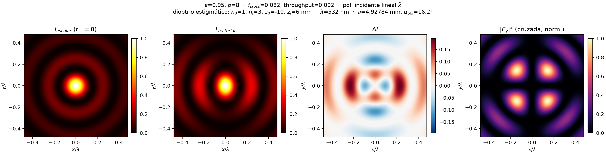

- **La base de polarización cambia la forma, no la energía, del canal cruzado**: con
  entrada lineal es el trébol sin²2φ; con entrada circular L es un **anillo con
  vórtice de carga 2** (|E_R|² = |B|², sin modulación azimutal). f_cross es idéntico.

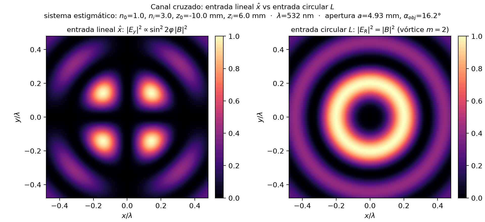

## Estudio 3 — Formación de imágenes (`study_3_imaging.py`)

Sistema 4f de dos dioptras conjugadas (D1: aire→2.4, D2: 2.4→aire, M = 2.4),
máscara de dos líneas (sep = 1.05 µm = 0.9·d_Airy en r_a = 4 mm), polarización x̂,
pupila circular en el plano de Fourier con radio barrido r_a = 2…6.5 mm
(α = 18°…47°). El escalar aplica t₊ en ambas dioptras con t₋ = 0.

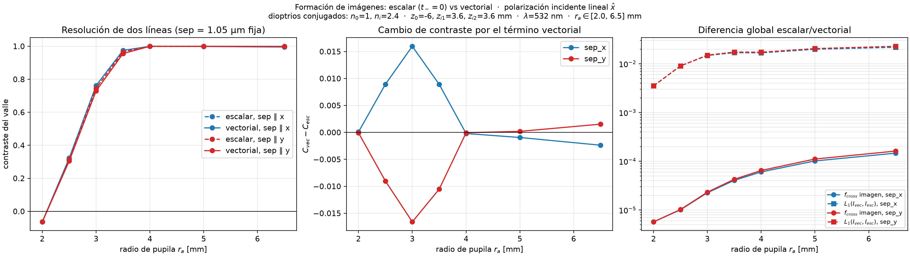

- **Resolución anisótropa cerca de Rayleigh.** En la transición (r_a ≈ 3 mm) el
  término vectorial **mejora** el contraste cuando la separación es paralela a la
  polarización (ΔC = +0.016) y lo **degrada** cuando es perpendicular (ΔC = −0.017)
  — coherente con el spot vectorial más angosto a lo largo de x̂ del Estudio 1. A
  apertura grande el signo se invierte levemente (el llenado del valle por E_y y el
  ringing coherente dominan).
- **Magnitud global.** La diferencia L1 normalizada entre imagen vectorial y escalar
  crece de 0.4% a **2.3%** de la energía de la imagen entre r_a = 2 y 6.5 mm; la
  fracción cruzada de la imagen crece de 5.7×10⁻⁶ a 1.6×10⁻⁴. En este sistema la
  mezcla ocurre casi toda en D2 (la pupila de Fourier abarca ~1.1 mm de radio sobre
  esa dioptra), no en el plano de máscara (donde t₋ ≈ 0).
- **Dónde aparece la luz cruzada en la imagen:** concentrada en los **extremos y
  esquinas de las líneas** (donde la máscara tiene contenido espectral diagonal), no
  distribuida uniformemente. ΔI muestra el llenado del valle central y la
  redistribución en los flancos.

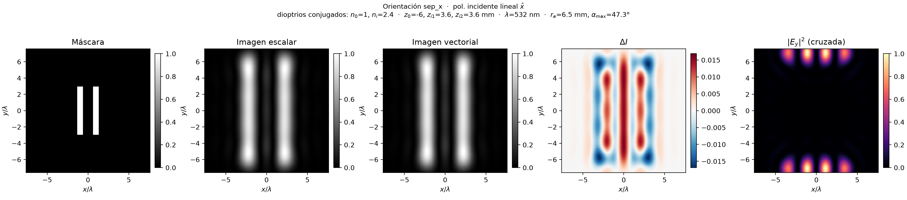
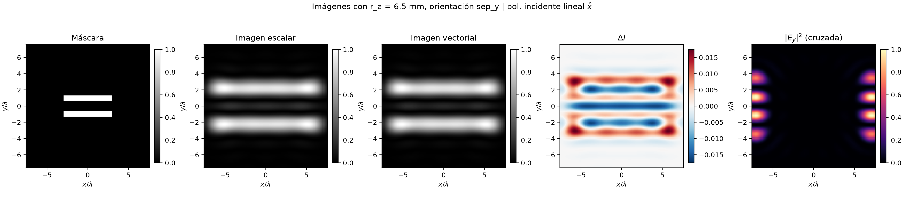
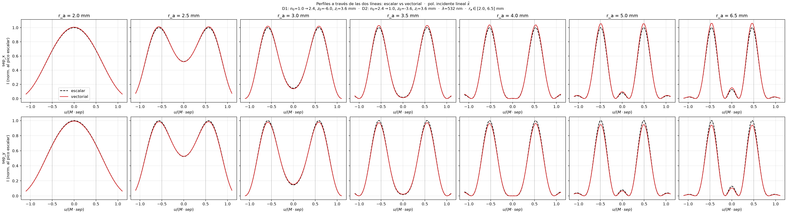

## Estudio 4 — Inversión de resolución: el escalar resuelve, el vectorial no (`study_4_resolution_inversion.py`)

Objetivo: encontrar configuraciones de dos características **distinguibles en el
modelo escalar (t₋=0) pero indistinguibles en el vectorial**, tanto para dos
líneas como para el caso canónico de dos características circulares (discos).

**Mecanismo y diseño.** A lo largo del eje de separación el campo copolar de la
imagen es A ∓ B (cos 2φ = ±1): B interfiere a *primer orden* con el campo
escalar A. Con separación **perpendicular** a la polarización (A + B) el valle
entre las dos imágenes se rellena; paralela, se profundiza. Para agrandar el
efecto se usa una dioptra de salida rápida (D2 con zᵢ = 0.6, M = 0.4) y pupila
ancha (r_a = 10 mm), que coloca el borde de la pupila de Fourier (≈1.29 mm)
cerca de la rama rasante de D2 (1.46 mm) manteniendo toda la pupila física.
Criterio de distinguibilidad: profundidad de valle C ≥ C_th.

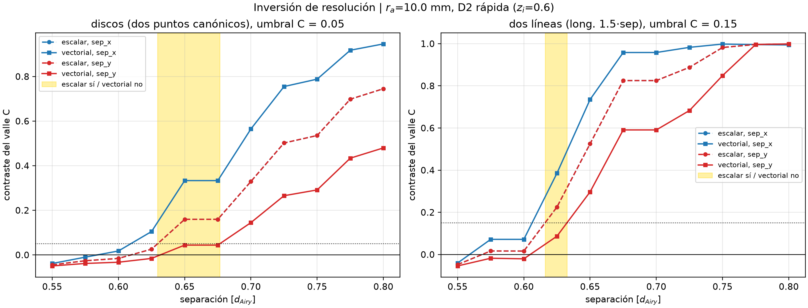

- **Discos (canónico), separación ⊥ polarización, C_th = 5%:** el umbral escalar
  está en sep* = 0.630·d_Airy y el vectorial en 0.677·d_Airy → **ventana de
  inversión de 0.047·d_Airy (~7% en separación)**. Escaparate en
  sep = 0.68·d_Airy = 0.51 µm: **C_esc = 0.159 (valle visible) vs
  C_vec = 0.044 (valle prácticamente plano)**.
- **Líneas:** las líneas largas promedian el término cos 2φ a lo largo de su
  longitud y su transición coherente de contraste es casi binaria (salta de
  ~0 a ~0.4 en menos de un píxel de máscara), así que se usan líneas cortas
  (longitud 1.5·sep) y el criterio tipo Rayleigh C_th = 15%. Ventana
  [0.616, 0.633]·d_Airy; escaparate en sep = 0.62·d_Airy = 0.47 µm:
  **C_esc = 0.225 vs C_vec = 0.087**.
- **La inversión es direccional**: con separación **paralela** a la polarización
  la ventana tiene signo opuesto (el vectorial resuelve *mejor* que el escalar,
  ventana −0.020·d_Airy en discos). El término vectorial no "borra" resolución
  de forma isótropa: la transfiere de una orientación a la otra.


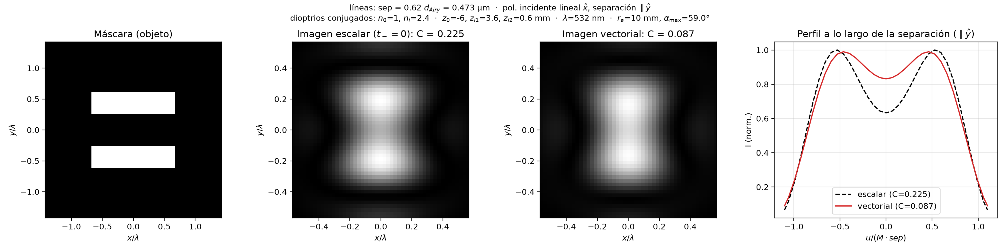

### Análisis de polarización de las imágenes

Para cada escaparate se analiza el estado de polarización de la imagen con los
mapas de polarización del paquete (`polarization_map_from_field` para los mapas
de Stokes — orientación ψ y elipticidad χ — y `plot_polarization_map`, vía
`plot_field_polarization`, para las elipses locales sobre la intensidad):

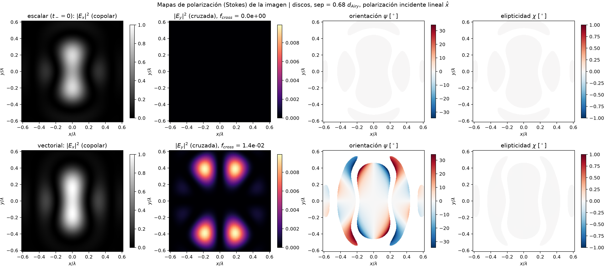
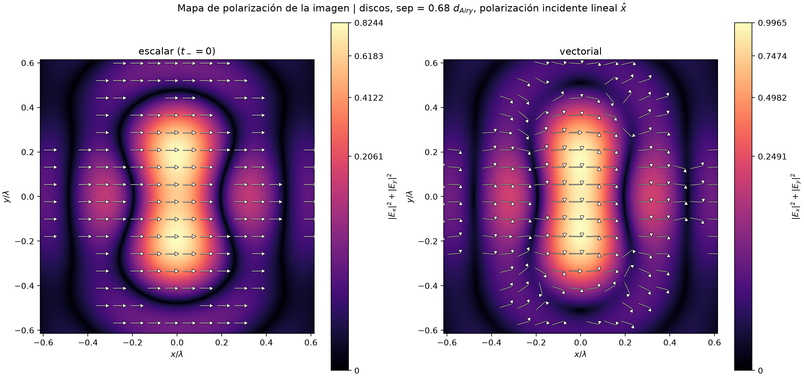
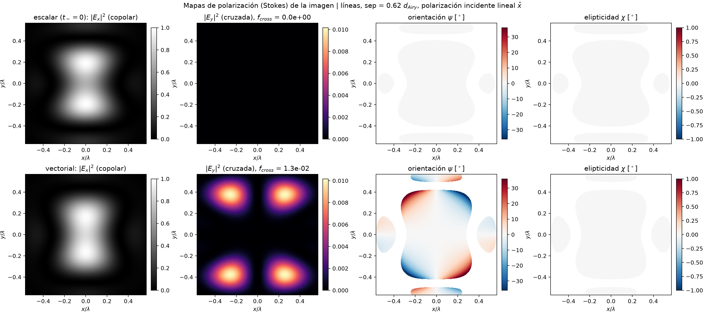
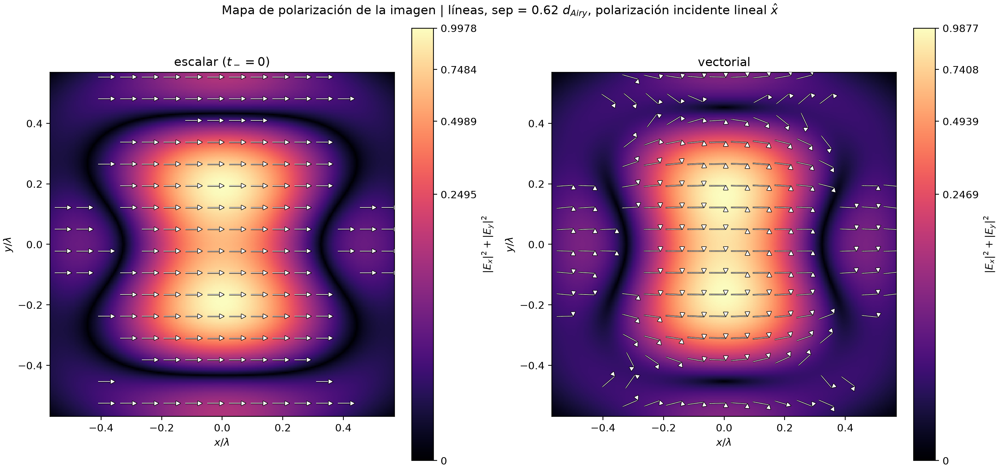

- **Imagen escalar:** polarización uniforme — E_y ≡ 0, ψ ≡ 0, χ ≡ 0 en todo el
  plano; las elipses son segmentos horizontales alineados con la polarización
  incidente x̂.
- **Imagen vectorial:** la fracción cruzada de la imagen es
  **f_cross ≈ 1.5×10⁻²** (dos órdenes por encima del sistema lento del
  Estudio 3). |E_y|² forma el trébol de cuatro lóbulos anclado a las esquinas
  de cada característica.
- **La luz cruzada está casi en fase con la copolar:** la elipticidad se
  mantiene |χ| ≲ 1° en toda la zona brillante — el campo sigue siendo casi
  lineal. El efecto dominante es una **rotación del plano de polarización**:
  ψ alcanza ±35° en los flancos laterales (donde el copolar es débil) con un
  patrón cuadrupolar antisimétrico, y unos pocos grados dentro de los lóbulos
  brillantes. Esa coherencia de fase entre A y B es justo lo que hace el
  llenado del valle un efecto de primer orden (2·Re(A·B*)) y no de segundo
  (|B|²).

## Síntesis

1. Al abrir la apertura, la componente cruzada crece como la **cuarta potencia** del
   ángulo de apertura y satura al llegar al límite geométrico del óvalo; con pupila
   uniforme y vidrio común (nᵢ=1.5) nunca pasa de ~0.2% de la energía focal.
2. Para **maximizarla**: (i) contraste de índices alto — el techo es
   (nᵢ−n₀)²/(nᵢ+n₀)² /2 aprox. —, (ii) pupila anular con peso al borde, que llega a
   ~80% del techo (8.2% con nᵢ=3), (iii) la geometría conjugada casi no importa.
   El costo es throughput: la mezcla vive donde la transmisión muere.
3. **Escalar vs vectorial en el spot:** mismo radio de energía encerrada, pero el
   spot vectorial es cuadrupolarmente anisótropo (hasta ~5% en HWHM, ~9% en el primer
   mínimo con pupila uniforme; 21% en HWHM con pupila anular extrema), más angosto a
   lo largo de la polarización incidente en este modelo transversal.
4. **En imágenes**, el término vectorial produce resolución dependiente de la
   orientación (±0.02 de contraste cerca de Rayleigh), una imagen fantasma cruzada
   localizada en bordes/esquinas, y diferencias globales de ~2% a NA alta.
5. **Existe un régimen de inversión de resolución**: con dioptra de salida rápida
   y separación perpendicular a la polarización hay una ventana de separaciones
   (~7% para dos puntos canónicos, ~3% para líneas cortas) en la que el modelo
   escalar predice dos características resueltas y el vectorial las muestra
   fusionadas — y la ventana cambia de signo al rotar la separación 90°.

## Límites del estudio

- Solo campo **transversal**: no se incluye la componente longitudinal E_z, que a
  NA alta contribuye a la elongación del spot *a lo largo* de la polarización y
  podría revertir el signo de la anisotropía total.
- El modelo del paquete usa ρ (parámetro del óvalo) como coordenada pupilar del
  kernel de Hankel/FFT; a ángulos extremos la correspondencia ρ ↔ dirección del rayo
  se degrada.
- La métrica de primer mínimo es ruidosa cuando se forman hombros (saltos entre
  mínimos locales); HWHM y r₅₀ son las métricas robustas.

## Reproducción

```bash
pip install -e .   # desde la raíz del repositorio
cd investigation/focal_plane_aperture_study
python study_1_aperture_sweep.py          # ~40 s
python study_2_maximize_cross.py          # ~60 s
python study_3_imaging.py                 # ~60 s
python study_4_resolution_inversion.py    # ~3 min
```

`imaging_common.py` contiene la maquinaria compartida del sistema de dos
dioptras usada por los estudios 3 y 4.

Las salidas completas van a `output/<script>/`; `results/` conserva las figuras y
CSV citados en este informe.
